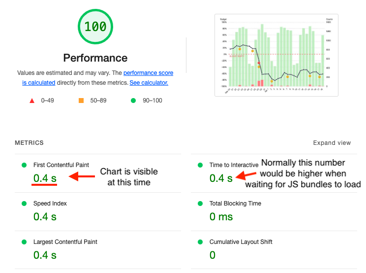

> 😅 Ok, I don't know if it's actually the best chart in the world, but I couldn't find an open-source chart library which did all these things! This post will go through all the features that make a good web chart and what I learnt when building it.
>
> **tl;dr** of the interesting things I learnt:
>
> Svelte and most other SSR implementations (eg. Next.js) are good at SSR unless you use a lib that does DOM manipulations (which is most of them 😢).
>
> [JS does not run ~1% of the time](https://gds.blog.gov.uk/2013/10/21/how-many-people-are-missing-out-on-javascript-enhancement/) (mostly for reasons other than people disabling it, like network errors) so SSR+progressive enhancement is actually pretty useful for this case.
>
> Making SVG responsive on resize without stretching certain elements (like text) is hard (but doable).
>
> Accessibility is hard. Not everyone agrees on what you should do and there's a [tradeoff between implementing what works well in screen readers vs what _should_ work well](https://blog.tenon.io/accessible-charts-with-aria/) (and not implementing that gives less incentives for screen readers to support it).
>
> There's an OS option to [reduce motion which you can read in CSS](https://css-tricks.com/introduction-reduced-motion-media-query/) and alter your animations accordingly.



Recently I was building a chart for a personal project but as I was trying out various open-source chart libraries I found that none of them ticked all the boxes. For example, [Chart.js](https://www.chartjs.org/) is the most popular one and looks nice but it renders to a canvas, meaning it:

- ❌ Requires JS to be enabled to work
- ❌ Cannot be server-side rendered
- ❌ Does not scale when zoomed in on
- ❌ Is not accessible (no semantic elements, not screen-readable)

There are other libraries which use SVG but I couldn't find one which solved _all_ of the problems above. And so without further ado, I present _the best chart in the world_:

<div class="iframe-container">
<iframe title="SLO chart demo" frameborder="0" height="500" width="100%" src="https://jakzo.github.io/slo-chart/"></iframe>
</div>

You can [see the code on GitHub](https://github.com/jakzo/slo-chart) or [open this demo](https://jakzo.github.io/slo-chart/) to view the chart in a separate window.

It's a chart for measuring SLOs. This type of chart is moderately complex to implement, with the features I implemented being:

- Stacked bar chart
- Line chart overlayed
- Separate axes for the bar and line charts
- A custom grid line (the "budget empty" line)
- Events markers
- A tooltip that displays raw numbers when hovering over a datapoint
- A fancy animation on load

> Note that I only built this specific chart type, not a chart library. It accepts custom data but you can't customise it to show different visualisations, rearrange the axes, etc. Sorry if you were hoping to use this in a project.

## What makes my chart good?

So far it's not looking any better than the other charts out there, but there are a bunch more features that you can't see from a screenshot. Let's go through them now:

### SSR compatible

The first thing to mention is that I made this using [SvelteKit](https://kit.svelte.dev/), which is designed for server-side rendering. SvelteKit produces a bundle for the browser and another for the server, and anything your server renders will be sent in the initial HTML payload then hydrated later once the frontend JS bundle is loaded. DOM manipulations outside of the Svelte framework (which most chart libraries do since that's the framework-agnostic way to do things) cannot be done on the server and must be done client side.

Because my chart is made up of SVG and HTML, it is sent in the SSR bundle. This means it:

- ✅ Loads fast 💨 (rather than waiting for heavy JS bundles to be loaded and executed)
- ✅ Is SEO-friendly 🤖 (web crawlers can read the charts)

Screenshot of Lighthouse performance report:



### Responsive

The chart is fitted to the size of the window. Resizing the window will cause the chart to resize too. This means it:

- ✅ Scales to different screen sizes without becoming distorted or pixelated 👌

<video src="./scaling.webm" autoplay muted loop controls></video>

_Look at that buttery smooth resizing!_

This is mostly because it is made of SVG elements. The browser takes care of rendering them properly regardless of zoom or size.

It may not seem like much but actually takes some care to do well while meeting the other constraints. Consider this: if you resize the screen to be wider, you'd expect that the bars would become wider, but what about the text? Actually they should not become wider or they'll look weird. The same goes for the circular dots on the line graph, event markers and the grid line dashes. So how did I do it?

1. The SVG uses a `viewport` attribute of `0 0 100 100` which lets our SVG coordinates be numbers between 0 and 100 and those coordinates will scale to whatever the size of the chart is.
1. All modern browsers support `vector-effect="non-scaling-stroke"` in SVG. This makes the thickness of all strokes (lines) not stretch. Instead only the coordinates of their path scale with the size of the SVG canvas. The dashes of the grid lines also stop stretching when this setting is enabled.
1. Text is rendered using HTML, not SVG. There is a [proposed vector-effect to make text not scale](https://www.w3.org/Graphics/SVG/WG/wiki/Proposals/vector_effects_extension), but that is not supported yet. To get around this I have a `<div>` containing the `<svg>` canvas and matches its size. This `<div>` has `position: relative` so that any text elements within it can have position: absolute and the `top` and `left` percentages will be in the same coordinate system as the SVG elements. This works great with the only minor drawback being that text cannot appear behind SVG elements. For example I would like the label on the "error budget" grid line to appear behind the error budget line itself, but that is simply not possible without z-index hacks (not ideal because can conflict with other elements on a page) or DOM shenanigans. I could absolutely position the SVG canvas and have the "error budget" text come before it in the DOM so it appears behind the canvas, but the point is there's no easy way to have text be layered in the SVG; it can only be in front or behind SVG canvases. There are [other hacks to render SVG text correctly](https://stackoverflow.com/a/61139485) but HTML is preferred for accessibility reasons.
1. The line dots and event markers are also HTML. They are implemented the same way as the HTML text.

I could have used JS to make this responsiveness easier, but by implementing it this way it:

- ✅ Is still responsive when JS is disabled
- ✅ Rerenders faster when size is changed

Finally the last thing I'll note about responsiveness is that the chart is not designed for mobile right now. For really thin screens the dates should collapse into weeks and the line dots should disappear. These are totally doable with CSS, I just didn't get around to it. 😅

### JS not required

Because it works with SSR and is responsive using only HTML/CSS, no scripting is required for the chart to work great! And BTW Javascript can fail to run [a surprisingly large amount of the time](https://kryogenix.org/code/browser/everyonehasjs.html) ([UK government measured it to be 1.1%](https://gds.blog.gov.uk/2013/10/21/how-many-people-are-missing-out-on-javascript-enhancement/) in case you were wondering). The only thing missing when JS is disabled is the tooltip which appears when hovering over a datapoint. So it:

- ✅ Works well even without Javascript

<video src="./nojs.webm" autoplay muted loop controls></video>

_Look ma, no Javascript!_

### Screen-readable and keyboard-navigable

Accessibility in charts is hard. There's still [active discussion on how it should be handled](https://www.w3.org/wiki/SVG_Accessibility/ARIA_roles_for_charts) which leads to conflicting advice in some cases. Overall there's a [tradeoff between optimising for what screen readers should be able to handle and what they can actually handle](https://blog.tenon.io/accessible-charts-with-aria/). In the end I decided to implement all the standard guidelines then test it in a screen reader and figure out a good UX for screen readers. What I added to achieve this is:

- `aria` roles on chart elements (specifically the bars and the whole chart itself)
- `aria-hidden` on labels (they are read by the day `aria-label`s so not needed)
- Each day has a focusable element which can be tabbed through or clicked/tapped on
- `aria-label`s on each day's element which have a readable summary of the data for that day

<video src="./screen-reader.webm" controls></video>

> ⚠️ Warning: this one has sound!

One thing I had to be careful with here: the `aria-label` for each day was the same as the tooltip text, except I had to add commas after the numbers, otherwise the screen readers I tested (Voice Over for Mac and Screen Reader extension for Chrome) would immediately read the next text which made it unclear (eg. they would read "good events \*pause\* five bad events \*pause\* two"). Perhaps I could use `aria-describedby` to point to a hidden tooltip element where each data point is in a separate `<li>` which might save me from having to engineer the text better for screen readers...

One more thing that could be added is a button to display the data in tabular format.

### Respects motion settings

OS' have an option for people who experience discomfort with vestibular motion. You can access this with a media query like so:

```css
@media (prefers-reduced-motion: reduce) {
  /* reduced motion styles */
}
```

The chart animations respect this and instead of the bars "growing" on load they will simply fade in if the user prefers reduced motion.

<video src="./reduced-motion.webm" autoplay muted loop controls></video>

### Dark mode 😎

And of course the last feature I'll show off is that it respects the OS setting for dark/light theme using this media query:

```css
@media (prefers-color-scheme: dark) {
  /* dark styles */
}
```

<video src="./dark-mode.webm" autoplay muted loop controls></video>

That's it! Thanks for coming along this journey learning about charts with me. 🙂
